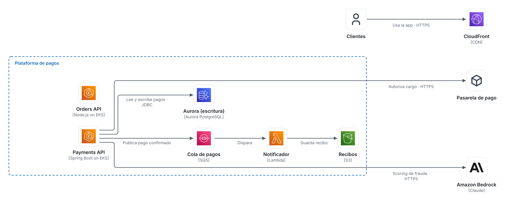
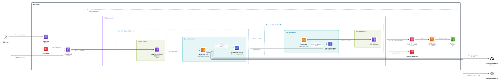

# Trazo

Diagramas de arquitectura que se dibujan solos. Escribes **qué** hay (un modelo [FINOS CALM](https://calm.finos.org) en YAML) y Trazo decide **dónde** va: layout automático con grupos anidados, flechas ancladas al icono, etiquetas sin solapes, modo claro y oscuro, y exportación a draw.io.

> Estado: **fase 0 (spike técnico)**. Hay un núcleo en TypeScript y una CLI; la app web llega en la fase 1. Plan completo y hallazgos en [docs/fase-0.md](docs/fase-0.md).





## Probarlo

```bash
pnpm install
pnpm render:example          # escribe out/*.light.svg, *.dark.svg y *.drawio
pnpm test
```

O directamente con la CLI:

```bash
cd packages/core
npx tsx src/cli.ts validate ../../examples/aws-pagos
npx tsx src/cli.ts render ../../examples/aws-pagos --out ../../out
```

`render` imprime métricas de calidad por vista: cruces, quiebros, solapes de etiquetas, flechas que atraviesan iconos y puntas de flecha mal ancladas.

## Workspace

```
examples/aws-pagos/
├── architecture.calm.yaml     # el modelo: CALM 1.2 válido
└── views/
    ├── infra-aws.view.yaml    # vista de despliegue (VPC, AZ, subredes)
    └── contenedores-c4.view.yaml  # vista C4 del mismo modelo
```

- **Un modelo, muchas vistas.** Cada elemento existe una vez. La vista elige qué jerarquía dibuja: `deployment` (relaciones CALM `deployed-in`) o `composition` (`composed-of`).
- **CALM estándar.** Lo específico de Trazo (icono, tecnología, nivel C4, estilo de grupo, tier) va en `metadata.trazo`, así que el fichero valida contra el meta-esquema oficial de CALM 1.2 (incluido en `packages/core/schemas`).
- **Git-friendly.** Las coordenadas no se guardan en el modelo: el layout es determinista y se recalcula.

## Estructura

| Ruta | Qué hace |
|---|---|
| `packages/core/src/model` | Carga y valida CALM, proyecta vistas |
| `packages/core/src/layout` | ELK layered (grupos, puertos, etiquetas), presets, simplificación de quiebros, métricas |
| `packages/core/src/render` | SVG con temas claro y oscuro |
| `packages/core/src/export` | `.drawio` con contenedores y waypoints |
| `packages/core/src/icons` | Iconos (Iconify `logos` y `tabler` en el spike) |

## Licencias de terceros

ELK (EPL-2.0), esquemas CALM (Apache-2.0), iconos Iconify `logos` (CC0) y `tabler` (MIT). Los logotipos son marcas de sus propietarios.
